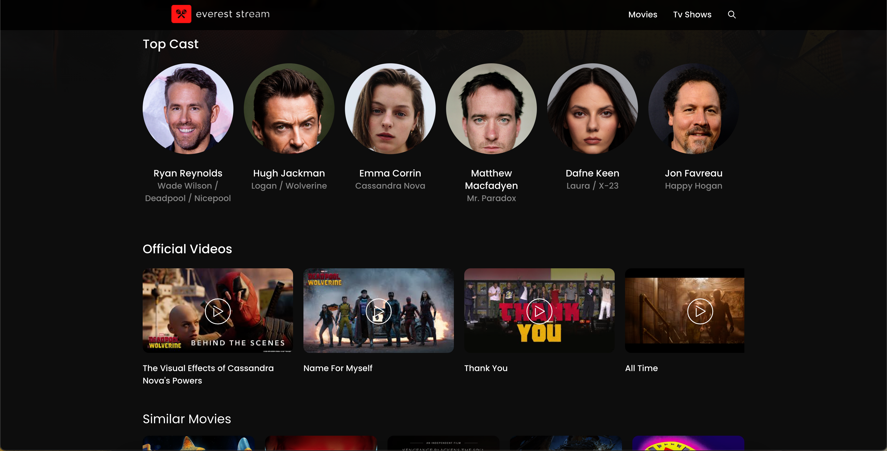

# EverestStream 🎥

**EverestStream** is a React.js application built using **Vite**, allowing users to explore detailed information about movies and TV shows. The app fetches data from the **TMDB (The Movie Database) API**, including descriptions, cast and crew details, official videos, and recommended shows/movies related to the selected title.

## Table of Contents

- [Features](#features)
- [Tech Stack](#tech-stack)
- [Setup and Installation](#setup-and-installation)
- [TMDB API Configuration](#tmdb-api-configuration)
- [How It Works](#how-it-works)
- [Screenshots](#screenshots)
- [Contributing](#contributing)
- [License](#license)

[](https://app.netlify.com/sites/evereststream/deploys)

## Features

- Browse movies and TV shows with detailed descriptions.
- View cast and crew information for each title.
- Watch official trailers, teasers, and videos related to movies/TV shows.
- Discover recommended movies or TV shows based on the selected title.
- Responsive UI for seamless viewing across devices.

## Tech Stack

- **Frontend**: React.js (with hooks and context), Vite
- **Styling**: CSS & Scss
- **API**: TMDB (The Movie Database) API
- **Routing**: React Router DOM
- **HTTP Client**: Axios and Fetch API
- **Deployment**: Netlify

## Setup and Installation

1. Clone the repository:
   ```bash
   git clone https://github.com/Pushparaj13811/EverestStream.git
   cd EverestStream
   ```

2. Install dependencies:
   ```bash
   npm install
   ```

3. Create a `.env` file in the root directory and add your **TMDB API key**:
   ```bash
   VITE_TMDB_API_KEY=your_tmdb_api_key_here
   ```

4. Start the development server:
   ```bash
   npm run dev
   ```

5. Open the app in your browser:
   ```
   http://localhost:3000
   ```

## TMDB API Configuration

To use the **TMDB API**, you'll need an API key. Follow these steps:

1. Sign up on [The Movie Database (TMDB)](https://www.themoviedb.org/).
2. Navigate to your account settings and find the **API section**.
3. Generate an API key.
4. Add the API key to your `.env` file as mentioned in the setup process.

## How It Works

1. **Home Page**: Users can view trending movies and TV shows fetched from TMDB.
2. **Movie/TV Show Details**: Clicking on a movie or TV show brings up detailed information, including:
   - Title, Description, Release Date, and Rating
   - Cast and Crew details
   - Official videos such as trailers and teasers
3. **Recommended Movies/TV Shows**: Below the details section, users can find similar or recommended content based on the selected movie or TV show.

### API Endpoints Used:
- **Popular Movies**: `/movie/popular`
- **Movie Details**: `/movie/{movie_id}`
- **TV Show Details**: `/tv/{tv_id}`
- **Cast and Crew**: `/movie/{movie_id}/credits` or `/tv/{tv_id}/credits`
- **Related Movies/TV Shows**: `/movie/{movie_id}/recommendations` or `/tv/{tv_id}/recommendations`
- **Official Videos**: `/movie/{movie_id}/videos` or `/tv/{tv_id}/videos`

## Screenshots

### Home Page


### Movie Details


### Explore


### Cast and Crew


## Contributing

Contributions are welcome! If you'd like to contribute, please fork the repository and make a pull request.

1. Fork the repository.
2. Create a new branch (`git checkout -b feature-branch`).
3. Make your changes.
4. Commit and push your changes (`git push origin feature-branch`).
5. Open a pull request.
